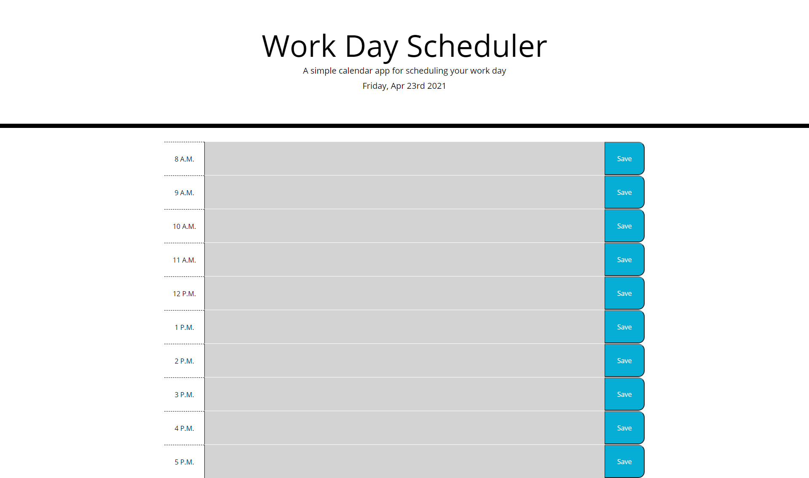

# 05 Third-Party APIs: Work Day Scheduler

## Description

The purpose of this project is to schedule a user's work life. The user can save his/her events into the event box and it will still persist even after closing the page.

Repo: https://dsollomoni.github.io/Third-Party-APIs-Work-Day-Scheduler/

